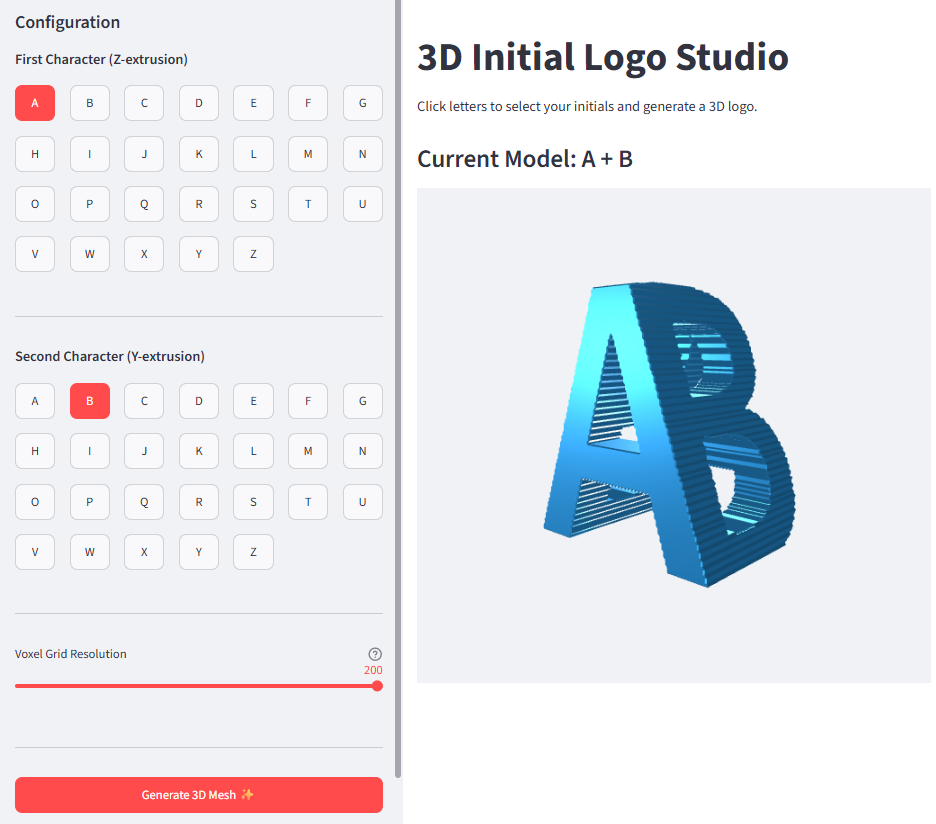

<link rel="stylesheet" href="https://fonts.googleapis.com/css?family=Corben:700">

<h1 align="center">
  <a href="https://3d-ils-dmj6kubfyxjpvuk9wrfoow.streamlit.app/" style="font-size: 1.6em; font-weight: bold; text-decoration: none; font-family: 'Corben', cursive; letter-spacing: 0.05em; font-style: italic;">
    3D Initial Logo Studio
  </a>
</h1>


An interactive Streamlit application that generates a 3D ambigram-like logo from two user-selected initials.

The generated object is constructed as the intersection of two orthogonally extruded letter volumes. When viewed from different directions, the resulting shape reveals different characters.




---

## Features

* Interactive web UI built with Streamlit
* A–Z character selection for two initials
* Adjustable voxel grid resolution
* Signed Distance Field (SDF)-based geometry generation
* Marching Cubes surface extraction
* Real-time 3D visualization using Three.js
* OBJ mesh export

---

## How It Works

The application generates a 3D shape through the following pipeline:

1. Load two binary letter images.
2. Compute a 2D Signed Distance Field (SDF) for each image.
3. Resample the SDF to the selected voxel resolution.
4. Extrude the first letter along the Z axis.
5. Extrude the second letter along the Y axis.
6. Compute the intersection volume using:

```text
combined_sdf = max(sdf1, sdf2)
```

7. Extract the zero level set using Marching Cubes.
8. Export the mesh as an OBJ file.
9. Display the result in an interactive Three.js viewer.

The generated object can be interpreted as the geometric intersection of two extruded characters.

---

## Project Structure

```text
project/
│
├── main.py
├── viewer_template.html
├── logo.obj
│
├── images/
│   ├── a.png
│   ├── b.png
│   ├── ...
│   └── z.png
│
└── README.md
```

Each letter image should be:

* Binary (black/white)
* Square
* Consistent resolution (e.g. 200×200)

---

## Requirements

### Python

Python 3.10 or later is recommended.

### Libraries

* numpy
* scipy
* scikit-image
* pillow
* streamlit

Install all dependencies using:

```bash
pip install -r requirements.txt
```

---

## Running the Application

Start the Streamlit application:

```bash
streamlit run main.py
```

After launch, open the displayed local URL in your browser.

Typically:

```text
http://localhost:8501
```

---

## Usage

1. Select the first character.
2. Select the second character.
3. Choose a voxel grid resolution.
4. Click **Generate 3D Mesh**.
5. Inspect the generated model in the viewer.

Mouse controls:

* Left drag: rotate
* Right drag: pan
* Mouse wheel: zoom

---

## Output

The generated mesh is exported as:

```text
logo.obj
```

This file can be imported into:

* Blender
* MeshLab
* Autodesk Fusion
* Unity
* Unreal Engine

and most other 3D software packages.

---

## Technical Notes

### Signed Distance Field (SDF)

The application uses Euclidean distance transforms to compute a signed distance field:

* Negative values: inside the character
* Positive values: outside the character

This representation enables smooth volumetric operations.

### Volume Intersection

The intersection of two implicit volumes is computed using:

```python
combined_sdf = np.maximum(sdf_field1, sdf_field2)
```

This is the standard constructive solid geometry (CSG) intersection operation for signed distance fields.

### Marching Cubes

The zero level set of the combined SDF is converted into a triangular mesh using the Marching Cubes algorithm provided by `scikit-image`.

---